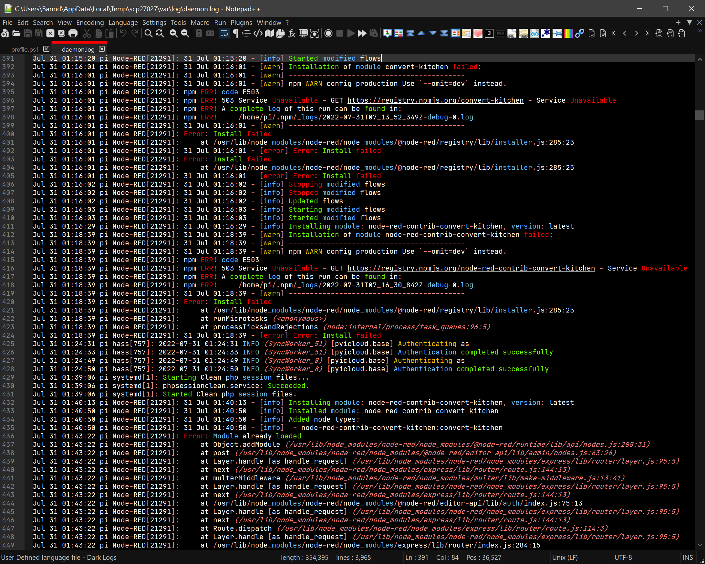
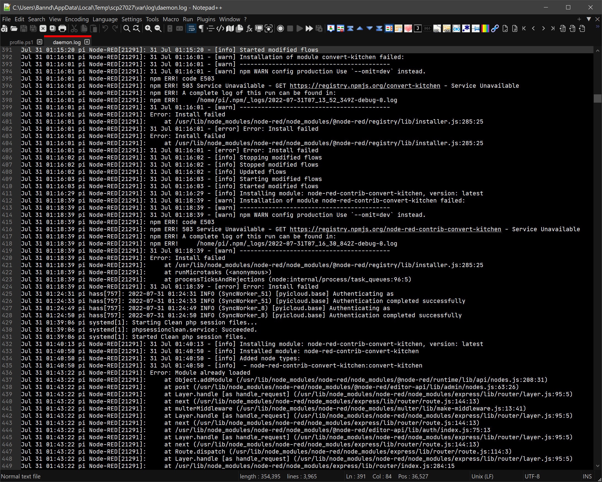

# LogsDark
A Notepad++ user defined language for adding dark mode syntax highlighting to logs

Notepad++ supports around 80 programming languages for syntax highlighting & folding. For languages that are not in the list of languages with built-in support, you can add syntax highlighting to the language.

To learn all about User Defined Languages:

https://npp-user-manual.org/docs/user-defined-language-system/

## Using a User Defined Language from this Repo

For now, you have to manually install a new User Defined Language.

1. Download a XML file from this repo
2. Import the file by placing the file in your `userDefineLangs` folder and restarting Notepad++.  (It is also possible to use the User Defined Language dialog box to **Import** your file, but that places the UDL in the combined file, which is more complicated to maintain).  More details of what those steps entail can be found in the ["Import a UDL" section](https://npp-user-manual.org/docs/user-defined-language-system/#import-a-udl) of the official documentation.

## Screenshots

After:

Before:
